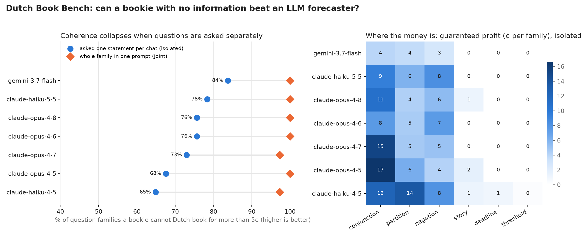

*This is a submission for the [Kaggle Benchmarking Challenge](https://dev.to/challenges/kaggle-2026-09-23).*

<!-- FINAL PASS: replace [[...]] with the day-2 numbers. Re-run `results` tables from results.md. -->

## What I Benchmarked

I run a bot in Metaculus' AI forecasting tournament. Like almost every forecasting bot, it sends each question to the model **in a fresh chat**. That made me wonder: if the same event shows up from two angles, *"Will the US unemployment rate be 5% or higher in December 2027?"* and *"Will it be below 5%?"*, do the two answers even add up to 100%?

If they don't, the forecaster is **Dutch-bookable**. A bookie can buy and sell its contracts so that it profits **whatever happens**. De Finetti showed in the 1930s that this is exactly what it means for a set of numbers to not be probabilities.

The nice property of coherence: **you don't need to know the future to measure it.** So the benchmark asks about 2027–2050 events that no model can have memorised, and still scores the answers today.

### The 37 question families

Each family is a set of statements about the same small set of possible worlds:

| Family type | Example | Coherence rule |
|---|---|---|
| negation (6) | "Apple's market cap > Microsoft's on 29 Dec 2028" / "Microsoft's ≥ Apple's" | P(A) + P(not A) = 1 |
| threshold (5) | Bitcoin on 31 Dec 2028 above $50k / $100k / $150k / $250k | must not increase with the threshold; this is how Metaculus builds numeric CDFs |
| deadline (4) | A human on Mars by 2030 / 2035 / 2040 / 2050 | must not decrease over time |
| partition (5) | Who wins the 2030 World Cup: Spain / France / Brazil / Argentina / England / anyone else | sums to 1 |
| conjunction (5) | A, B, "A and B", "A or B" | P(A∧B) ≤ min, P(A∨B) ≥ max, P(A) + P(B) = P(A∧B) + P(A∨B) |
| story (3) | "A Cat 4–5 hurricane hits the US in 2028" vs "…and causes >$50B damage" | the detailed version can't be more likely (the Linda problem) |

28 families are about the real future. **9 are controls** (dice, coins, cards) with exact answers. The controls separate "can't compute probabilities" from "is incoherent when genuinely uncertain".

Every statement is asked **in isolation**, in a fresh chat, the way bots do it. Every family is also asked **jointly**, in one prompt. About 160 calls per model, temperature 0.

### The metric: how much can a bookie lock in?

For each family I compute the **guaranteed profit** of a bookie who can trade at most $1 of each contract at the model's quoted prices. By LP duality this equals the L1 distance from the model's answers to the nearest coherent set of probabilities, and a tiny exact solver computes it for any family shape. A coherent forecaster gives the bookie $0.

**Leaderboard score = arbitrage-free rate**: the % of families (asked in isolation) on which the bookie can lock in at most 5¢. Models that fail to answer ≥10% of families (API errors, no parseable number) are not scored at all, so a dropped call never counts as incoherence.

## Models Tested

[[Day 2: list all models + why: every model on Kaggle's roster that fit a $10/day quota, cheap and diverse first.]]

Day 1 (this write-up's tables): `google/gemini-3.7-flash` (the task default), `claude-haiku-4-5`, `claude-haiku-5-5`, `claude-opus-4-5`, `claude-opus-4-6`, `claude-opus-4-7`, `claude-opus-4-8`. [[Day 2 additions.]]

A note on honesty about infrastructure: Kaggle's model proxy reserves each call's worst-case cost against a $10/day quota, and my first run silently turned refused calls into "incoherent" scores. The benchmark now retries, caps `max_tokens`, records API errors, and refuses to score a model with low coverage. If you build a benchmark on Kaggle, check this first.

## Findings

**1. Every model knows the rules of probability. It just doesn't apply them across separate calls.**
On the 9 dice-and-card controls, all 7 models are essentially perfectly coherent (≤ 1¢ per family, Brier ≈ 0). Asked a whole family in one prompt, they are 97–100% arbitrage-free. Asked one statement per chat, they drop to **65–84%**. The problem is not ignorance; it is isolation, which is exactly how forecasting bots call these models.

**2. The money is in conjunctions, partitions and negations. Monotone families are free.**
Deadlines ("by 2030 / 2035 / 2040") and thresholds ("above $50k / $100k / …") were 100% arbitrage-free for every model: models handle *monotone* structure fine even across calls. The three family types with a *conservation law* are where the bookie eats:

| family type | arbitrage-free rate (isolated, all models) |
|---|---|
| conjunction | 51% |
| partition | 55% |
| negation | 64% |
| story | 96% |
| deadline | 100% |
| threshold | 100% |

**3. The most expensive single answers.** A bookie earns these with zero information:
- `claude-opus-4-7`, climate conjunction: P(2028 anomaly > 1.30 °C) = **0.35**, P(Sept-2028 Arctic ice < 4.0M km²) = **0.38**, P(both) = **0.28**, P(at least one) = **0.90**. Worth **45¢** per $1 contract. "At least one" cannot be 0.90 when the parts are 0.35 and 0.38.
- `claude-opus-4-5`, earthquake conjunction: P(M7+ in California by 2035) = **0.85**, P(M7+ in Kanto) = **0.72**, P(both) = **0.18**. With 0.85 and 0.72, "both" has to be at least 0.57. **45¢**.
- `claude-haiku-5-5`, climate again: P(A) = **0.70** but P(A or B) = **0.46**. **44¢**.
- `claude-haiku-4-5`, unemployment: P(≥ 5.0%) = **0.62** and P(< 5.0%) = **0.68**. They sum to **1.30**: the model agrees with whichever framing it is shown.
- `claude-haiku-4-5`, "which of 2027–2030 will be the warmest year": the four mutually exclusive answers sum to **1.32**.

**4. The best model was the cheapest one.** `gemini-3.7-flash` (2¢/family) beat every Claude Opus (4–5¢). Scale and price buy knowledge; they do not buy consistency across calls. [[Day 2: does this hold across providers? reasoning vs non-reasoning?]]

**5. Temperature 0 is not deterministic on this proxy.** The default model scored 67.6%, 75.7% and 83.8% on three identical runs. A single-run leaderboard number carries roughly ±8 points of noise, so I report family-level cents alongside the headline percentage and would treat differences under ~10 points as a tie.

**6. The Linda problem is mostly solved.** Adding a plausible detail ("…aboard a SpaceX Starship") almost never raised the probability (story families 96% arbitrage-free). Opus 4.5 and 4.8 each did it once, by 5–7¢.

### What I'd measure next
- Paraphrase robustness: the negation failures suggest an *acquiescence* effect, so ask the same family with "Will X happen?" vs "Is it false that X happens?".
- Whether sampling 5 answers and averaging recovers coherence (it should reduce the variance in finding 5, but not the systematic conjunction errors).
- Resolved questions, in a year: does coherence predict accuracy?

### If you build forecasting bots
- For multiple-choice and numeric questions, ask for **all options / the whole CDF in one call** and renormalise.
- For anything else, **project your answers onto the coherent set** after the fact. Because the true outcome is a vertex of that convex set, the projection can never make the Brier score worse, whatever happens. The LP in the notebook does it.

## My Benchmark

- Kaggle benchmark: [[benchmark link]]
- Kaggle notebook (questions, solver, all code): [[notebook link]]
- Source, offline test and results: [[GitHub link]]

Prior work: *Consistency Checks for Language Model Forecasters* (Paleka et al.) also uses arbitrage to score consistency. What's different here: exact-answer controls next to open questions, a direct isolated-vs-joint comparison, one generic LP that turns any family of events into a guaranteed-profit number, and Kaggle's model roster.
